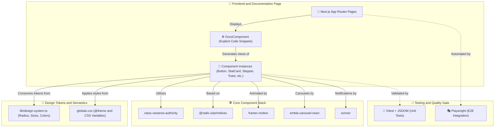
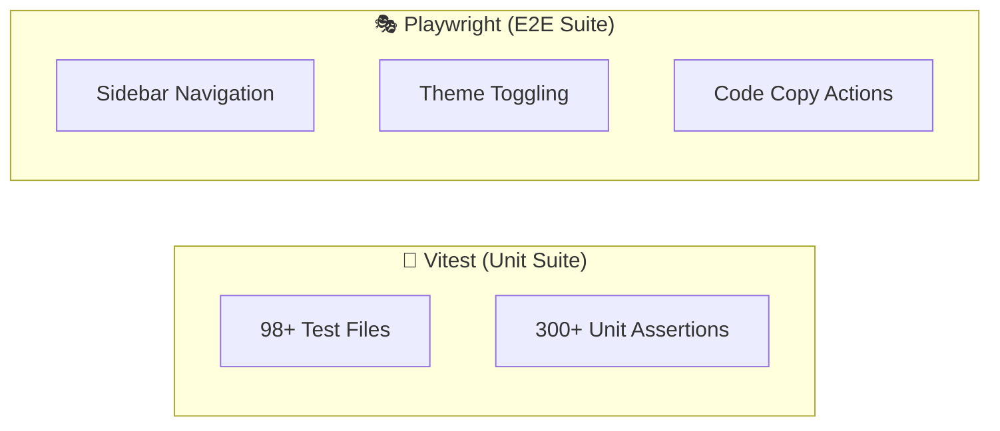

<div align="center">
  <br/>
  <br/>
  
  <br/>
  <br/>
  <p>
    🇺🇸 <strong>English Version</strong> | 🇧🇷 <a href="./README.md">Versão em Português</a>
  </p>
</div>

<br />

## 🌟 Overview

**Bloom** is a professional UI component library based on React 19, Next.js 16, Radix UI, and Tailwind CSS v4. Developed under strict performance and accessibility standards, the library centralizes design tokens into semantic CSS variables and structured JavaScript maps, enabling complete light/dark theme consistency and instant visual adaptations.

The library includes robust layout controls, fluid animations via Framer Motion, and a complete suite of automated behavior and integration regression tests.

## 🚀 Deployment & Demo

The interactive documentation portal and complete component guide is available at:
👉 **[https://bloom.guibus.dev/](https://bloom.guibus.dev/)**

---

## 📦 Installation & Hybrid Distribution

<div align="center">
  <a href="https://github.com/gui-bus/Bloom/actions/workflows/ci.yml">
    
  </a>
  <a href="https://www.npmjs.com/package/@bloomui-react/cli">
    
  </a>
  <a href="https://www.npmjs.com/package/@bloomui-react/components">
    
  </a>
  <a href="https://www.npmjs.com/package/@bloomui-react/components">
    
  </a>
</div>

<br />

Bloom supports a **hybrid installation model**: you can have full control of the code by copying components via CLI, or install the compiled component library via NPM.

### Option 1: CLI (Copy-Paste with Custom Source Code)

```bash
# 1. Initialize Bloom in your project
npx @bloomui-react/cli init

# 2. Add components to your project (also creates markdown docs in lib/docs/ for AI)
npx @bloomui-react/cli add button card

# 3. Update components to the latest versions
npx @bloomui-react/cli update

# 4. Verify the integrity of your setup (health-check)
npx @bloomui-react/cli doctor

# 5. Uninstall components and clean generated files
npx @bloomui-react/cli uninstall
```

👉 **[See the complete CLI usage guide](./docs/cli.en.md)**

### Option 2: NPM Package (`@bloomui-react/components`)

```bash
npm install @bloomui-react/components
```

```tsx
import { Button, TableOfContents, Snippet } from "@bloomui-react/components";

export default function App() {
  return <Button color="primary">Hello Bloom</Button>;
}
```

---

## 🛠️ Tech Stack

<div align="center">
  
  
  
  
  
  
  
  
  
  
  
  
  
  
  
  
  
</div>

---

## 🏛️ System Architecture

Bloom bases its architecture on the clear separation between the structural logic layer, shared design tokens, and validation infrastructure:



---

## 🚀 Implemented Components (98 Components)

| Component | Category | Description |
| :--- | :--- | :--- |
| **Autocomplete** | Inputs & Controls | Search field with dynamic autocomplete suggestions. |
| **Audio Recorder** | Inputs & Controls | Interactive audio recorder with wave visualizer and file download. |
| **Button** | Inputs & Controls | Internal ripple effect, loading/disabled states, sizes, colors, and polymorphism. |
| **Button Group** | Inputs & Controls | Fluid fusion of multiple buttons with automatic property propagation. |
| **Checkbox** | Inputs & Controls | Accessible checkbox with support for disabled states and selectable cards. |
| **Color Picker** | Inputs & Controls | Interactive color selector with palette preview and HEX/RGB values. |
| **Color Swatches** | Inputs & Controls | Pre-defined color palette for quick and friendly selection. |
| **Combobox** | Inputs & Controls | Searchable field with dynamic option filtering and keyboard navigation. |
| **Date Picker** | Inputs & Controls | Date selection with support for modal calendars and ranges. |
| **File Input** | Inputs & Controls | Styled file input with max size support, progress, allowed types, and tag badges. |
| **File Upload** | Inputs & Controls | Drag & drop zone for sending files with progress bars. |
| **Filter Builder** | Inputs & Controls | Structured boolean filter builder for advanced queries. |
| **Form / FormField** | Inputs & Controls | Form structure with validation, wrapped fields, and error messages. |
| **Image Cropper** | Inputs & Controls | Image cropper with zoom, rotation, circular or rectangular mask, and base64 export. |
| **Input** | Inputs & Controls | Text input with support for icons, labels, and validations. |
| **Input OTP** | Inputs & Controls | Separate numeric inputs for two-step verification codes (2FA). |
| **Label** | Inputs & Controls | Native and accessible form label integrated with inputs. |
| **Mention Textarea** | Inputs & Controls | Textarea with support for @/# mentions with avatars, handles, and styled suggestion panel. |
| **Multi Select** | Inputs & Controls | Multiple tag selection menu with direct removal and flexible search. |
| **Number Input** | Inputs & Controls | Numeric input control with increment/decrement buttons and currency support. |
| **Password Input** | Inputs & Controls | Password field with strength meter and dynamic security rule checks. |
| **Radio Group** | Inputs & Controls | Single selection group with labels and support for extended cards. |
| **Rating** | Inputs & Controls | Star rating with support for fractional selection and custom values. |
| **Rich Text Editor** | Inputs & Controls | Rich text editor (WYSIWYG) based on Tiptap. |
| **Select** | Inputs & Controls | Dropdown selection menu with groups, search, and styled options. |
| **Signature Input** | Inputs & Controls | Handwritten signature drawing field with color, stroke options, and PNG/SVG export. |
| **Slider** | Inputs & Controls | Slider control for selecting ranges or numeric values. |
| **Snippet** | Inputs & Controls | Single-line command block with quick copy and OS variants (mac, powershell, cmd, ubuntu, default). |
| **Switch** | Inputs & Controls | Toggle switch with color, size, and card mode support. |
| **Tag Input** | Inputs & Controls | Dynamic tag input with autocomplete, limits, duplication, and custom validations. |
| **Textarea** | Inputs & Controls | Multi-line text field with height auto-expansion and character counter. |
| **Time Picker** | Inputs & Controls | Time selector with sliding columns and 12h/24h mode support. |
| **Toggle** | Inputs & Controls | Two-state toggle button with default, outline, and flat styles. |
| **Toggle Group** | Inputs & Controls | Segmented toggle group for single or multiple selection. |
| **Transfer List** | Inputs & Controls | Dual transfer list to move items interactively with search filters. |
| **Tabs** | Navigation | Animated tabs synchronized with `framer-motion` in multiple styles. |
| **Breadcrumb** | Navigation | Accessible hierarchical path with icons and support for `DropdownMenu` on the ellipsis. |
| **Command** | Navigation | Fast global search and command palette accessible via keyboard. |
| **Menubar** | Navigation | Desktop-style menu bar for navigation in complex applications. |
| **Navigation Menu** | Navigation | Complex navigation menu with popover support and enriched content. |
| **Pagination** | Navigation | URL-jump-free pagination controls with first/last page jump. |
| **Stepper** | Navigation | Step indicator for wizards with error states and support for horizontal and vertical modes. |
| **Kbd** | Navigation | Visual indicator for keyboard keys and shortcuts. |
| **Link** | Navigation | Styled links integrated into the router with hover effects. |
| **Alert** | Overlays & Feedback | Warning banner and informative messages with accents per severity state. |
| **Alert Dialog** | Overlays & Feedback | Critical confirmation modal blocking irreversible actions. |
| **Banner** | Overlays & Feedback | Global announcement or warning banners fixed at the top/bottom of the layout. |
| **Confetti** | Overlays & Feedback | Celebratory physics particle animation component based on presets. |
| **Context Menu** | Overlays & Feedback | Context menu under right-click with submenu support. |
| **Dialog** | Overlays & Feedback | Accessible overlay modal window via Radix Dialog. |
| **Drawer** | Overlays & Feedback | Bottom/side sliding panel maintaining the maximum layout width of 110rem. |
| **Dropdown Menu** | Overlays & Feedback | Floating dropdown menu with items, groups, separators, and keyboard shortcuts. |
| **Hover Card** | Overlays & Feedback | Floating card displayed on hover for detailed information. |
| **Popover** | Overlays & Feedback | Overlay panel triggered by click to display quick controls and forms. |
| **Sheet** | Overlays & Feedback | Absolute floating side panel with backdrop blur, dark, and light options. |
| **Toast** | Overlays & Feedback | Glassmorphic notification popover with status sidebars and actions. |
| **Tooltip** | Overlays & Feedback | Floating explanatory label with arrow indicator for interactive elements. |
| **Tour** | Overlays & Feedback | Interactive onboarding assistant with responsive spotlights and celebration. |
| **Accordion** | Layout & Display | List of expandable/collapsible sections via Radix with animated rotation. |
| **Aspect Ratio** | Layout & Display | Fixed aspect ratio container for responsive media. |
| **Avatar / Avatar Group** | Layout & Display | Profile picture with initials fallback and avatar stack with counter. |
| **Badge** | Layout & Display | Compact label with variants, status dots, and icons. |
| **Bento Grid** | Layout & Display | Bento box-style grid for highlight layouts supporting images, icons, and col/row spans. |
| **Card** | Layout & Display | Structured neutral container with header, body, and footer. |
| **Carousel** | Layout & Display | Fluid slide carousel with swipe gestures and navigation controls. |
| **Chart** | Layout & Display | Interactive visual charts built for dashboards. |
| **Circular Progress** | Layout & Display | Radial circular progress indicator with central percentage, sizes, and colors. |
| **Code Block** | Layout & Display | Code block with syntax highlighting, OS variant, one-click copy, and tags. |
| **Collapsible** | Layout & Display | Expandable/collapsible element with smooth height animation. |
| **Data Table** | Layout & Display | Advanced data table with sorting, filters, and pagination. |
| **Diff Viewer** | Layout & Display | Comparative code difference viewer (Diff) in side-by-side or line-by-line modes. |
| **Event Calendar** | Layout & Display | Interactive event calendar with month/week/day modes and click-to-create events. |
| **File Explorer** | Layout & Display | File tree explorer with expand/collapse, rename, delete, add, and search. |
| **Gantt Chart** | Layout & Display | Visual Gantt chart with tasks, milestones, durations, dependencies, and groupings. |
| **Gauge** | Layout & Display | Speedometer/thermometer style measurement indicator with support for ticks and LED bar styling (dashes). |
| **Heatmap Grid** | Layout & Display | Heatmap grid for visualizing activity over time, similar to GitHub Contributions. |
| **Image** | Layout & Display | Responsive image with loading fallbacks and visual effects. |
| **JSON Tree Viewer** | Layout & Display | Collapsible tree viewer for JSON objects with value-type highlighting and key copying. |
| **Kanban Board** | Layout & Display | Interactive Kanban board with draggable columns, tasks, and WIP limits. |
| **List** | Layout & Display | Ordered and unordered list with support for icons and dividers. |
| **Logo Clouds** | Layout & Display | Showcase of partner logos with grid, infinite marquee, and batch swap animation variants. |
| **Progress** | Layout & Display | Animated linear progress bar for task status. |
| **Resizable** | Layout & Display | Resizable panels with draggable dividers via `react-resizable-panels`. |
| **Scroll Area** | Layout & Display | Styled scroll area via Radix integrated into the sidebar. |
| **Separator** | Layout & Display | Horizontal or vertical visual divider supporting labels and gradients. |
| **Skeleton** | Layout & Display | Animated pulse-style placeholder for loading content. |
| **Spinner** | Layout & Display | Rotating loading indicator with semantic sizes and colors. |
| **Stat Card** | Layout & Display | KPI metrics card with icons, values, and trend indicators. |
| **Table** | Layout & Display | Styled HTML table with rounded corners and row selection. |
| **Table of Contents** | Layout & Display | Scroll-indexed topic navigation with dynamic highlight (IntersectionObserver) and autoScan. |
| **Testimonials** | Layout & Display | Customer testimonials in grid, masonry, carousel, split, and infinite marquee variants. |
| **Timeline** | Layout & Display | Ordered chronological event timeline with icons and nodes support. |
| **Tree View** | Layout & Display | Interactive navigation and directory tree with expandable nodes. |
| **Typography** | Layout & Display | Text hierarchy scale from H1 to H6, paragraphs, lead, and code blocks. |
| **Virtualized List** | Layout & Display | High-performance virtualized scrolling list for thousands of records. |

---

## 🧪 Automated Testing

The Bloom ecosystem adopts automated test coverage to ensure stability during every refactoring:



### 🚀 Execution Commands

```bash
# Run unit test suite with Vitest
pnpm test:unit

# Run E2E test suite with Playwright
pnpm test:e2e
```

---

## 📑 Additional Technical Documentation

Refer to the [`/docs`](./docs/README.en.md) folder for further architectural details:

* 📦 [**`docs/cli.en.md`**](./docs/cli.en.md): CLI Usage Guide — how to initialize and install components in your project.
* 🏗️ [**`docs/architecture.en.md`**](./docs/architecture.en.md): Next.js App Router, layout, and build pipeline specification.
* 🎨 [**`docs/design-system.en.md`**](./docs/design-system.en.md): Details of the neutral color palette, sizing scale, rounded corners (radius), and rules for new components.
