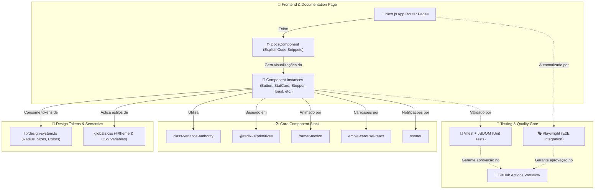
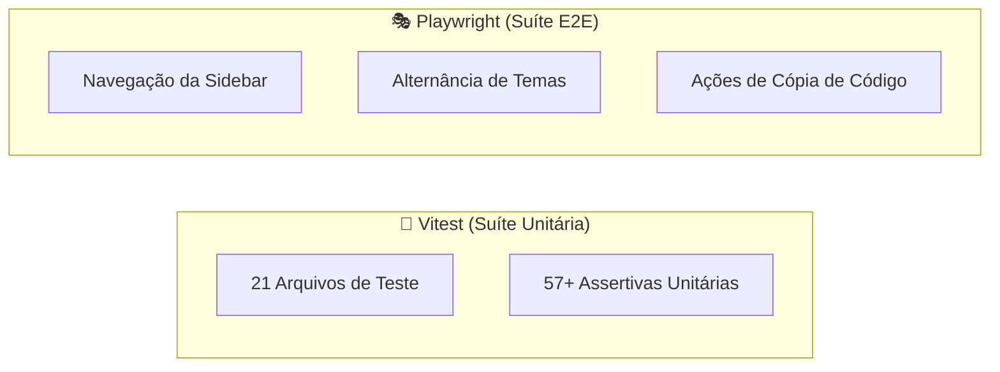

<div align="center">
  <br/>
  <br/>
  
  <br/>
  <br/>
  
</div>

<br />

## 🌟 Visão Geral

O **Bloom** é uma biblioteca profissional de componentes de interface (UI) premium baseada em React 19, Next.js 16, Radix UI e Tailwind CSS v4. Desenvolvida sob rígidos padrões de performance e acessibilidade, a biblioteca centraliza tokens de design em variáveis CSS semânticas e mapas de JavaScript estruturados, possibilitando a consistência completa de temas claro/escuro e adaptações visuais instantâneas.

A biblioteca inclui controles de layout robustos, animações fluidas via Framer Motion, e uma suíte completa de testes de regressão de comportamento e integração automatizados.

## 🚀 Deploy & Demonstração

O projeto de documentação e demonstração interativa dos componentes estará disponível no seguinte endereço:
👉 **[https://bloom.guibus.dev/](https://bloom.guibus.dev/)**

---

## 📦 CLI — Instale os Componentes no Seu Projeto

<div align="center">
  <a href="https://www.npmjs.com/package/@bloomui-react/cli">
    
  </a>
  <a href="https://www.npmjs.com/package/@bloomui-react/cli">
    
  </a>
</div>

O Bloom disponibiliza uma **CLI oficial** que permite inicializar o design system e adicionar componentes diretamente no seu projeto, sem precisar clonar este repositório.

```bash
# 1. Inicialize o Bloom no seu projeto
npx @bloomui-react/cli init

# 2. Adicione o componente desejado
npx @bloomui-react/cli add button
```

A CLI detecta automaticamente o seu gerenciador de pacotes (`npm`, `pnpm`, `yarn` ou `bun`), instala todas as dependências necessárias e copia o código-fonte do componente com os caminhos de importação já configurados para a sua estrutura de projeto.

👉 **[Veja o guia completo de uso da CLI](./docs/cli.md)**

## 🛠️ Stack Tecnológica

<div align="center">
  
  
  
  
  
  
  
  
  
  
  
</div>

---

## 🏛️ Arquitetura do Sistema

O Bloom baseia sua arquitetura na separação clara entre a camada de lógica estrutural, design tokens compartilhados e infraestrutura de validação:



---

## 🚀 Componentes Implementados (63 Componentes)

| Componente | Categoria | Descrição |
| :--- | :--- | :--- |
| **Button** | Inputs & Controles | Ripple effect interno, estados loading/disabled, tamanhos, cores e polimorfismo. |
| **Button Group** | Inputs & Controles | Junção fluida de múltiplos botões com propagação automática de propriedades. |
| **Checkbox** | Inputs & Controles | Caixa de seleção acessível com suporte a estados indisponíveis e cartões selecionáveis. |
| **Color Picker** | Inputs & Controles | Seletor de cores interativo com pré-visualização de paletas e valores HEX/RGB. |
| **Combobox** | Inputs & Controles | Campo de busca pesquisável com filtro dinâmico de opções e teclado. |
| **Date Picker** | Inputs & Controles | Seleção de datas com suporte a calendários modais e intervalos. |
| **File Upload** | Inputs & Controles | Zona de drag & drop para envio de arquivos com barras de progresso. |
| **Form / FormField** | Inputs & Controles | Estrutura de formulários com validação, campos envelopados e mensagens de erro. |
| **Input** | Inputs & Controles | Entrada de texto com suporte a ícones, rótulos e validações. |
| **Input OTP** | Inputs & Controles | Entradas numéricas separadas para códigos de verificação em duas etapas (2FA). |
| **Number Input** | Inputs & Controles | Controle de entrada numérica com botões de incremento/decremento. |
| **Radio Group** | Inputs & Controles | Grupo de seleção única com rótulos e suporte a cards estendidos. |
| **Rating** | Inputs & Controles | Avaliação por estrelas com suporte a seleção fracionada e valores customizados. |
| **Select** | Inputs & Controles | Menu de seleção suspenso com grupos, busca e opções estilizadas. |
| **Slider** | Inputs & Controles | Controle deslizante para seleção de intervalos ou valores numéricos. |
| **Switch** | Inputs & Controles | Interruptor de alternância ligar/desligar com suporte a cores, tamanhos e modo card. |
| **Textarea** | Inputs & Controles | Campo de texto multilinha com auto-expansão de altura e contador de caracteres. |
| **Toggle** | Inputs & Controles | Botão de alternância de dois estados com estilos default, outline e flat. |
| **Toggle Group** | Inputs & Controles | Grupo de alternância segmentado para seleção única ou múltipla. |
| **Tabs** | Navegação | Abas animadas sincronizadas com `framer-motion` em múltiplos estilos. |
| **Breadcrumb** | Navegação | Trilha hierárquica acessível com ícones e suporte a `DropdownMenu` na elipse. |
| **Menubar** | Navegação | Barra de menus estilo desktop para navegação em aplicações complexas. |
| **Navigation Menu** | Navegação | Menu de navegação complexo com suporte a popovers e conteúdo enriquecido. |
| **Pagination** | Navegação | Controles de paginação sem salto de URL com salto para primeira/última página. |
| **Stepper** | Navegação | Indicador de etapas para wizards com estados de erro e suporte aos modos horizontal e vertical. |
| **Kbd** | Navegação | Indicador visual de teclas e atalhos do teclado. |
| **Link** | Navegação | Links estilizados integrados ao roteador com efeitos de hover. |
| **Alert** | Overlays & Feedback | Banner de aviso e mensagens informativas com acentos por estado de gravidade. |
| **Alert Dialog** | Overlays & Feedback | Modal de confirmação crítico com bloqueio de ações irreversíveis. |
| **Dialog** | Overlays & Feedback | Janela modal sobreposta acessível via Radix Dialog. |
| **Drawer** | Overlays & Feedback | Painel deslizante inferior/lateral mantendo a largura máxima do layout de 110rem. |
| **Dropdown Menu** | Overlays & Feedback | Menu suspenso flutuante com itens, grupos, separadores e atalhos de teclado. |
| **Hover Card** | Overlays & Feedback | Cartão flutuante exibido no hover para informações detalhadas. |
| **Popover** | Overlays & Feedback | Painel sobreposto acionado por clique para exibir controles e formulários rápidos. |
| **Sheet** | Overlays & Feedback | Painel lateral absolute flutuante com opções de backdrop blur, dark e light. |
| **Toast** | Overlays & Feedback | Popover glassmorphic de notificação com barras laterais de status e ações. |
| **Tooltip** | Overlays & Feedback | Rótulo explicativo flutuante com indicador de seta para elementos interativos. |
| **Accordion** | Layout & Exibição | Lista de seções expansíveis/recolhíveis via Radix com rotação animada. |
| **Aspect Ratio** | Layout & Exibição | Contêiner de proporção fixa para mídia responsiva. |
| **Avatar / Avatar Group** | Layout & Exibição | Foto de perfil com fallback de iniciais e pilha de avatares com contador. |
| **Badge** | Layout & Exibição | Rótulo compacto com variantes, pontos de status e ícones. |
| **Card** | Layout & Exibição | Contêiner neutro estruturado com cabeçalho, corpo e rodapé. |
| **Chart** | Layout & Exibição | Gráficos visuais interativos construídos para dashboards. |
| **Code Block** | Layout & Exibição | Bloco de código com destaque de sintaxe, cópia com um clique e tags. |
| **Collapsible** | Layout & Exibição | Elemento expansível/recolhível com animação suave de altura. |
| **Data Table** | Layout & Exibição | Tabela de dados avançada com ordenação, filtros e paginação. |
| **Image** | Layout & Exibição | Imagem responsiva com fallbacks de carregamento e efeitos visuais. |
| **List** | Layout & Exibição | Lista ordenada e não ordenada com suporte a ícones e divisores. |
| **Progress** | Layout & Exibição | Barra de progresso linear animada para status de tarefas. |
| **Resizable** | Layout & Exibição | Painéis redimensionáveis com divisores arrastáveis via `react-resizable-panels`. |
| **Scroll Area** | Layout & Exibição | Área de rolagem estilizada via Radix integrada à barra lateral. |
| **Separator** | Layout & Exibição | Divisor visual horizontal ou vertical com suporte a labels e gradientes. |
| **Skeleton** | Layout & Exibição | Placeholder animado estilo pulse para conteúdos em carregamento. |
| **Spinner** | Layout & Exibição | Indicador de carregamento rotativo com tamanhos e cores semânticas. |
| **Stat Card** | Layout & Exibição | Cartão de métricas KPI com ícones, valores e indicadores de tendência. |
| **Table** | Layout & Exibição | Tabela HTML estilizada com bordas arredondadas e seleção de linhas. |
| **Typography** | Layout & Exibição | Escala de hierarquia de texto de H1 a H6, parágrafos, lead e blocos de código. |

---

## 🧪 Testes Automatizados

O ecossistema Bloom adota uma cobertura de testes automatizada para assegurar estabilidade em cada refatoração:



### 🚀 Comandos de Execução

```bash
# Rodar suíte de testes unitários com Vitest
pnpm test:unit

# Rodar suíte de testes E2E com Playwright
pnpm test:e2e
```

---

## 🏁 Inicialização Local

### 1. Clonar e Instalar

```bash
git clone https://github.com/gui-bus/Bloom.git
cd Bloom
pnpm install
```

### 2. Rodar Ambiente de Desenvolvimento

```bash
pnpm dev
```

Abra [http://localhost:3000](http://localhost:3000) no seu navegador para explorar o portal de documentação interativo.

---

## 📑 Documentação Técnica Adicional

Consulte a pasta [`/docs`](./docs/README.md) para detalhamentos adicionais de arquitetura:

* 📦 [**`docs/cli.md`**](./docs/cli.md): Guia de uso da CLI — como inicializar e instalar componentes no seu projeto.
* 🏗️ [**`docs/architecture.md`**](./docs/architecture.md): Especificação do Next.js App Router, layout e pipeline de build.
* 🎨 [**`docs/design-system.md`**](./docs/design-system.md): Detalhamento da paleta de cores neutras, escala de tamanhos, cantos arredondados (radius) e regras para novos componentes.
