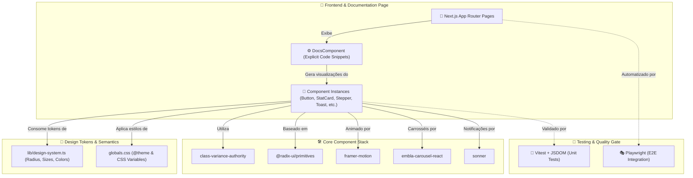
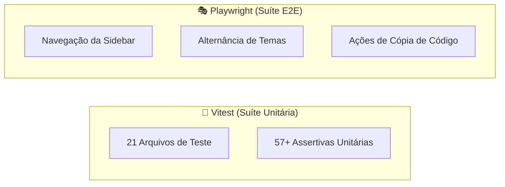

<div align="center">
  <br/>
  <br/>
  
  <br/>
  <br/>
</div>

<br />

## 🌟 Visão Geral

O **Bloom** é uma biblioteca profissional de componentes de interface (UI) premium baseada em React 19, Next.js 16, Radix UI e Tailwind CSS v4. Desenvolvida sob rígidos padrões de performance e acessibilidade, a biblioteca centraliza tokens de design em variáveis CSS semânticas e mapas de JavaScript estruturados, possibilitando a consistência completa de temas claro/escuro e adaptações visuais instantâneas.

A biblioteca inclui controles de layout robustos, animações fluidas via Framer Motion, e uma suíte completa de testes de regressão de comportamento e integração automatizados.

## 🚀 Deploy & Demonstração

O portal de documentação interativo e guia completo dos componentes está disponível no seguinte endereço:
👉 **[https://bloom.guibus.dev/](https://bloom.guibus.dev/)**

---

## 📦 Instalação & Distribuição Híbrida

<div align="center">
  <a href="https://www.npmjs.com/package/@bloomui-react/cli">
    
  </a>
  <a href="https://www.npmjs.com/package/@bloomui-react/components">
    
  </a>
  <a href="https://www.npmjs.com/package/@bloomui-react/components">
    
  </a>
</div>

<br />

O Bloom oferece suporte a um **modelo híbrido de instalação**: você pode ter controle total do código copiando componentes via CLI ou instalar a biblioteca de componentes compilada via NPM.

### Opção 1: CLI (Copy-Paste com Código-Fonte Próprio)

```bash
# 1. Inicialize o Bloom no seu projeto
npx @bloomui-react/cli init

# 2. Adicione o componente desejado
npx @bloomui-react/cli add button
```

👉 **[Veja o guia completo de uso da CLI](./docs/cli.md)**

### Opção 2: Pacote NPM (`@bloomui-react/components`)

```bash
npm install @bloomui-react/components
```

```tsx
import { Button, TableOfContents, Snippet } from "@bloomui-react/components";

export default function App() {
  return <Button color="primary">Hello Bloom</Button>;
}
```

---

## 🛠️ Stack Tecnológica

<div align="center">
  
  
  
  
  
  
  
  
  
  
</div>

---

## 🏛️ Arquitetura do Sistema

O Bloom baseia sua arquitetura na separação clara entre a camada de lógica estrutural, design tokens compartilhados e infraestrutura de validação:



---

## 🚀 Componentes Implementados (95 Componentes)

| Componente | Categoria | Descrição |
| :--- | :--- | :--- |
| **Autocomplete** | Inputs & Controles | Campo de busca com sugestões de autocompletar dinâmicas. |
| **Audio Recorder** | Inputs & Controles | Gravador de áudio interativo com visualizador de ondas e download de arquivo. |
| **Button** | Inputs & Controles | Ripple effect interno, estados loading/disabled, tamanhos, cores e polimorfismo. |
| **Button Group** | Inputs & Controles | Junção fluida de múltiplos botões com propagação automática de propriedades. |
| **Checkbox** | Inputs & Controles | Caixa de seleção acessível com suporte a estados indisponíveis e cartões selecionáveis. |
| **Color Picker** | Inputs & Controles | Seletor de cores interativo com pré-visualização de paletas e valores HEX/RGB. |
| **Color Swatches** | Inputs & Controles | Paleta de cores pré-definidas para seleção rápida e amigável. |
| **Combobox** | Inputs & Controles | Campo de busca pesquisável com filtro dinâmico de opções e teclado. |
| **Date Picker** | Inputs & Controles | Seleção de datas com suporte a calendários modais e intervalos. |
| **File Upload** | Inputs & Controles | Zona de drag & drop para envio de arquivos com barras de progresso. |
| **Filter Builder** | Inputs & Controles | Construtor de filtros booleanos estruturados para consultas avançadas. |
| **Form / FormField** | Inputs & Controles | Estrutura de formulários com validação, campos envelopados e mensagens de erro. |
| **Image Cropper** | Inputs & Controles | Cropper de imagens com zoom, rotação, máscara circular ou retangular e exportação base64. |
| **Input** | Inputs & Controles | Entrada de texto com suporte a ícones, rótulos e validações. |
| **Input OTP** | Inputs & Controles | Entradas numéricas separadas para códigos de verificação em duas etapas (2FA). |
| **Label** | Inputs & Controles | Rótulo de formulário nativo e acessível integrado aos inputs. |
| **Mention Textarea** | Inputs & Controles | Textarea com suporte a menções @/# com avatares, handles e painel de sugestões estilizado. |
| **Multi Select** | Inputs & Controles | Menu de seleção de tags múltiplas com remoção direta e busca flexível. |
| **Number Input** | Inputs & Controles | Controle de entrada numérica com botões de incremento/decremento e suporte a moedas. |
| **Password Input** | Inputs & Controles | Campo de senha com medidor de força e verificação de regras de segurança dinâmica. |
| **Radio Group** | Inputs & Controles | Grupo de seleção única com rótulos e suporte a cards estendidos. |
| **Rating** | Inputs & Controles | Avaliação por estrelas com suporte a seleção fracionada e valores customizados. |
| **Rich Text Editor** | Inputs & Controles | Editor de texto rico (WYSIWYG) baseado em Tiptap. |
| **Select** | Inputs & Controles | Menu de seleção suspenso com grupos, busca e opções estilizadas. |
| **Signature Input** | Inputs & Controles | Campo de desenho de assinatura manuscrita com opções de cor, traço e exportação em PNG/SVG. |
| **Slider** | Inputs & Controles | Controle deslizante para seleção de intervalos ou valores numéricos. |
| **Snippet** | Inputs & Controles | Bloco de comando em linha única com cópia rápida e variantes de SO (mac, powershell, cmd, ubuntu, default). |
| **Switch** | Inputs & Controles | Interruptor de alternância ligar/desligar com suporte a cores, tamanhos e modo card. |
| **Tag Input** | Inputs & Controles | Entrada de tags dinâmicas com autocompletar, limites, duplicações e validações customizadas. |
| **Textarea** | Inputs & Controles | Campo de texto multilinha com auto-expansão de altura e contador de caracteres. |
| **Time Picker** | Inputs & Controles | Seletor de horário com suporte a colunas deslizantes e modo 12h/24h. |
| **Toggle** | Inputs & Controles | Botão de alternância de dois estados com estilos default, outline e flat. |
| **Toggle Group** | Inputs & Controles | Grupo de alternância segmentado para seleção única ou múltipla. |
| **Transfer List** | Inputs & Controles | Lista de transferência dupla para mover itens de forma interativa com filtros de busca. |
| **Tabs** | Navegação | Abas animadas sincronizadas com `framer-motion` em múltiplos estilos. |
| **Breadcrumb** | Navegação | Trilha hierárquica acessível com ícones e suporte a `DropdownMenu` na elipse. |
| **Command** | Navegação | Paleta de busca e comandos global rápida acessível via teclado. |
| **Menubar** | Navegação | Barra de menus estilo desktop para navegação em aplicações complexas. |
| **Navigation Menu** | Navegação | Menu de navegação complexo com suporte a popovers e conteúdo enriquecido. |
| **Pagination** | Navegação | Controles de paginação sem salto de URL com salto para primeira/última página. |
| **Stepper** | Navegação | Indicador de etapas para wizards com estados de erro e suporte aos modos horizontal e vertical. |
| **Kbd** | Navegação | Indicador visual de teclas e atalhos do teclado. |
| **Link** | Navegação | Links estilizados integrados ao roteador com efeitos de hover. |
| **Alert** | Overlays & Feedback | Banner de aviso e mensagens informativas com acentos por estado de gravidade. |
| **Alert Dialog** | Overlays & Feedback | Modal de confirmação crítico com bloqueio de ações irreversíveis. |
| **Banner** | Overlays & Feedback | Faixas de anúncios ou avisos globais fixados no topo/base do layout. |
| **Confetti** | Overlays & Feedback | Componente de animação comemorativa de partículas físicas baseada em presets. |
| **Context Menu** | Overlays & Feedback | Menu contextual sob clique direito acessível com suporte a submenus. |
| **Dialog** | Overlays & Feedback | Janela modal sobreposta acessível via Radix Dialog. |
| **Drawer** | Overlays & Feedback | Painel deslizante inferior/lateral mantendo a largura máxima do layout de 110rem. |
| **Dropdown Menu** | Overlays & Feedback | Menu suspenso flutuante com itens, grupos, separadores e atalhos de teclado. |
| **Hover Card** | Overlays & Feedback | Cartão flutuante exibido no hover para informações detalhadas. |
| **Popover** | Overlays & Feedback | Painel sobreposto acionado por clique para exibir controles e formulários rápidos. |
| **Sheet** | Overlays & Feedback | Painel lateral absolute flutuante com opções de backdrop blur, dark e light. |
| **Toast** | Overlays & Feedback | Popover glassmorphic de notificação com barras laterais de status e ações. |
| **Tooltip** | Overlays & Feedback | Rótulo explicativo flutuante com indicador de seta para elements interativos. |
| **Tour** | Overlays & Feedback | Assistente interativo de onboarding com spotlights responsivos e celebração. |
| **Accordion** | Layout & Exibição | Lista de seções expansíveis/recolhíveis via Radix com rotação animada. |
| **Aspect Ratio** | Layout & Exibição | Contêiner de proporção fixa para mídia responsiva. |
| **Avatar / Avatar Group** | Layout & Exibição | Foto de perfil com fallback de iniciais e pilha de avatares com contador. |
| **Badge** | Layout & Exibição | Rótulo compacto com variantes, pontos de status e ícones. |
| **Bento Grid** | Layout & Exibição | Grade estilo bento box para layouts de destaque com suporte a imagens, ícones e spans de colunas/linhas. |
| **Card** | Layout & Exibição | Contêiner neutro estruturado com cabeçalho, corpo e rodapé. |
| **Carousel** | Layout & Exibição | Carrossel de slides fluido com gestos de swipe e controles de navegação. |
| **Chart** | Layout & Exibição | Gráficos visuais interativos construídos para dashboards. |
| **Code Block** | Layout & Exibição | Bloco de código com destaque de sintaxe, variante de SO, cópia com um clique e tags. |
| **Collapsible** | Layout & Exibição | Elemento expansível/recolhível com animação suave de altura. |
| **Data Table** | Layout & Exibição | Tabela de dados avançada com ordenação, filtros e paginação. |
| **Diff Viewer** | Layout & Exibição | Visualizador comparativo de diferenças de código (Diff) em modos lado a lado ou linha por linha. |
| **Event Calendar** | Layout & Exibição | Calendário de eventos interativo com modos mês/semana/dia e criação de eventos por clique. |
| **File Explorer** | Layout & Exibição | Explorador de arquivos em árvore com expand/collapse, rename, delete, add e busca. |
| **Gantt Chart** | Layout & Exibição | Gráfico de Gantt visual com tarefas, marcos, durações, dependências e agrupamentos. |
| **Heatmap Grid** | Layout & Exibição | Grade de heatmap para visualização de atividades ao longo do tempo, similar ao GitHub Contributions. |
| **Image** | Layout & Exibição | Imagem responsiva com fallbacks de carregamento e efeitos visuais. |
| **JSON Tree Viewer** | Layout & Exibição | Visualizador de objetos JSON em árvore colapsável com destaque por tipo de valor e cópia de chaves. |
| **Kanban Board** | Layout & Exibição | Quadro Kanban interativo com colunas arrastáveis, tarefas, e limites WIP. |
| **List** | Layout & Exibição | Lista ordenada e não ordenada com suporte a ícones e divisores. |
| **Logo Clouds** | Layout & Exibição | Showcase de logos de parceiros com variantes grid, marquee infinito e swap animation por lotes. |
| **Progress** | Layout & Exibição | Barra de progresso linear animada para status de tarefas. |
| **Resizable** | Layout & Exibição | Painéis redimensionáveis com divisores arrastáveis via `react-resizable-panels`. |
| **Scroll Area** | Layout & Exibição | Área de rolagem estilizada via Radix integrada à barra lateral. |
| **Separator** | Layout & Exibição | Divisor visual horizontal ou vertical com suporte a labels e gradientes. |
| **Skeleton** | Layout & Exibição | Placeholder animado estilo pulse para conteúdos em carregamento. |
| **Spinner** | Layout & Exibição | Indicador de carregamento rotativo com tamanhos e cores semânticas. |
| **Stat Card** | Layout & Exibição | Cartão de métricas KPI com ícones, valores e indicadores de tendência. |
| **Table** | Layout & Exibição | Tabela HTML estilizada com bordas arredondadas e seleção de linhas. |
| **Table of Contents** | Layout & Exibição | Navegação por índice de tópicos com destaque dinâmico por scroll (IntersectionObserver) e autoScan. |
| **Testimonials** | Layout & Exibição | Depoimentos de clientes em variantes grid, masonry, carrossel, split e marquee infinito. |
| **Timeline** | Layout & Exibição | Linha de eventos cronológicos ordenados com suporte a ícones e nós. |
| **Tree View** | Layout & Exibição | Árvore de navegação e diretórios interativa com nós expansíveis. |
| **Typography** | Layout & Exibição | Escala de hierarquia de texto de H1 a H6, parágrafos, lead e blocos de código. |
| **Virtualized List** | Layout & Exibição | Lista de rolagem virtualizada de alta performance para milhares de registros. |

---

## 🧪 Testes Automatizados

O ecossistema Bloom adota uma cobertura de testes automatizada para assegurar estabilidade em cada refatoração:



### 🚀 Comandos de Execução

```bash
# Rodar suíte de testes unitários com Vitest
pnpm test:unit

# Rodar suíte de testes E2E com Playwright
pnpm test:e2e
```

---

## 📑 Documentação Técnica Adicional

Consulte a pasta [`/docs`](./docs/README.md) para detalhamentos adicionais de arquitetura:

* 📦 [**`docs/cli.md`**](./docs/cli.md): Guia de uso da CLI — como inicializar e instalar componentes no seu projeto.
* 🏗️ [**`docs/architecture.md`**](./docs/architecture.md): Especificação do Next.js App Router, layout e pipeline de build.
* 🎨 [**`docs/design-system.md`**](./docs/design-system.md): Detalhamento da paleta de cores neutras, escala de tamanhos, cantos arredondados (radius) e regras para novos componentes.
