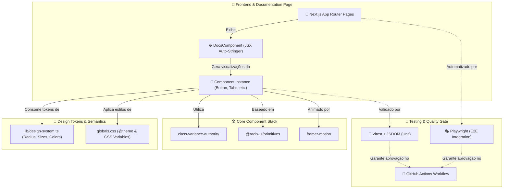
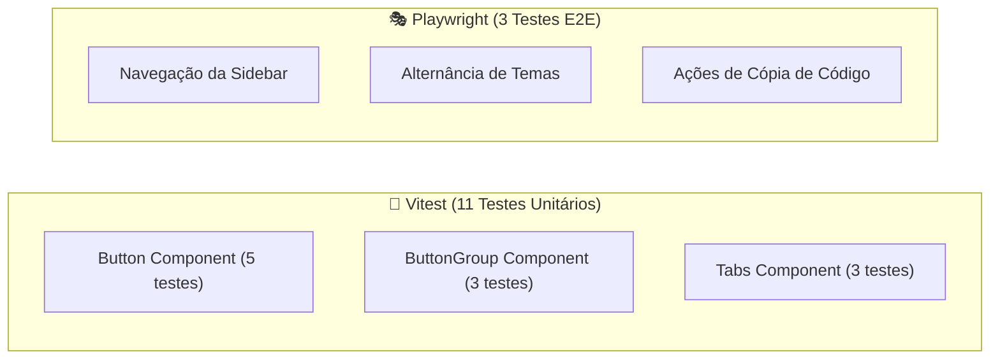

<div align="center">
  <br/>
  <br/>
  
  <br/>
  <br/>
  
</div>

<br />

## 🌟 Visão Geral

O **Bloom** é uma biblioteca profissional de componentes de interface (UI) premium baseada em React, Radix UI e Tailwind CSS. Desenvolvida sob rígidos padrões de performance e acessibilidade, a biblioteca centraliza tokens de design em variáveis CSS semânticas e mapas de JavaScript estruturados, possibilitando a consistência completa de temas claro/escuro e adaptações visuais instantâneas.

A biblioteca inclui controles de layout robustos, animações fluidas via Framer Motion, e uma suíte completa de testes de regressão de comportamento e integração automatizados.

## 🚀 Deploy & Demonstração

O projeto de documentação e demonstração interativa dos componentes estará disponível no seguinte endereço:
👉 **EM BREVE**

---

## 📦 CLI — Instale os Componentes no Seu Projeto

<div align="center">
  <a href="https://www.npmjs.com/package/@bloomui-react/cli">
    
  </a>
  <a href="https://www.npmjs.com/package/@bloomui-react/cli">
    
  </a>
</div>

O Bloom disponibiliza uma **CLI oficial** que permite inicializar o design system e adicionar componentes diretamente no seu projeto, sem precisar clonar este repositório.

```bash
# 1. Inicialize o Bloom no seu projeto
npx @bloomui-react/cli init

# 2. Adicione o componente desejado
npx @bloomui-react/cli add button
```

A CLI detecta automaticamente o seu gerenciador de pacotes (`npm`, `pnpm`, `yarn` ou `bun`), instala todas as dependências necessárias e copia o código-fonte do componente com os caminhos de importação já configurados para a sua estrutura de projeto.

👉 **[Veja o guia completo de uso da CLI](./docs/cli.md)**

## 🛠️ Stack Tecnológica

<div align="center">
  
  
  
  
  
  
  
  
  
  
  
</div>

---

## 🏛️ Arquitetura do Sistema

O Bloom baseia sua arquitetura na separação clara entre a camada de lógica estrutural, design tokens compartilhados e infraestrutura de validação:



---

## 🚀 Funcionalidades Principais

| Componente | Funcionalidades | Detalhes Técnicos |
| :--- | :--- | :--- |
| **🔘 Button** | • Ripple effect interno nativo<br/>• Estados de loading & disabled<br/>• Badges e ícones ajustáveis | Variações estruturadas via `cva`. Callback otimizado com `React.useCallback` e efeito ripple controlado por estado React. |
| **🗂️ Button Group** | • Junção fluida de múltiplos botões<br/>• Propagação automática de propriedades<br/>• Controle inteligente de bordas | Injeção e clonagem dinâmica de propriedades em componentes filhos via `React.Children` e `React.cloneElement`. |
| **📁 Tabs** | • Navegação animada e fluida<br/>• Layouts horizontais com scroll oculto<br/>• Suporte completo a acessibilidade | Baseado em `@radix-ui/react-tabs` e sincronizado com `framer-motion` (`AnimatePresence`) para transições de conteúdo. |
| **📑 Centralized Tokens** | • Escala padronizada (xs a 3xl)<br/>• Tema claro/escuro dinâmico<br/>• Cores semânticas extensíveis | Gerenciamento centralizado em [design-system.ts](file:///c:/Users/Guilherme/Desktop/PROJETOS/ZoeUI/lib/design-system.ts) e mapeamento dinâmico no Tailwind CSS v4. |

---

## 🧪 Testes Automatizados (14 Testes)

O ecossistema Bloom adota uma cobertura de testes moderna e de alta velocidade para assegurar que refatorações ou novos componentes não introduzam regressões funcionais:



### 🚀 Comandos de Execução

```bash
# Rodar suíte de testes unitários com Vitest
pnpm test:unit

# Rodar suíte de testes E2E com Playwright
pnpm test:e2e
```

---

## 🏁 Inicialização Local

### 1. Clonar e Instalar

```bash
git clone https://github.com/gui-bus/Bloom.git
cd Bloom
pnpm install
```

### 2. Rodar Ambiente de Desenvolvimento

```bash
pnpm dev
```

Abra [http://localhost:3000](http://localhost:3000) no seu navegador para explorar o portal de documentação interativo.

---

## 📑 Documentação Técnica Adicional

Consulte a pasta [`/docs`](./docs/README.md) para detalhamentos adicionais de arquitetura:

* 📦 [**`docs/cli.md`**](./docs/cli.md): Guia de uso da CLI — como inicializar e instalar componentes no seu projeto.
* 🏗️ [**`docs/architecture.md`**](./docs/architecture.md): Especificação do Next.js App Router, layout e pipeline de build.
* 🎨 [**`docs/design-system.md`**](./docs/design-system.md): Detalhamento da paleta de cores, escala de tamanhos, cantos arredondados (radius) e regras para novos componentes.
